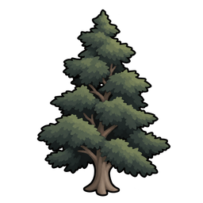
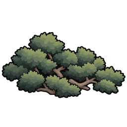

# Ancient & Medieval Japan - Environment（中世日本 - 環境）

**RimWorld 1.6 — Beta**

A standalone environment overhaul that replaces and reconfigures Vanilla terrain, vegetation, and biome composition for a Japanese-archipelago-inspired landscape. It changes world climate, mountains, rivers, coastlines, natural soil distribution, and the placement and vegetation of biomes to create a **pre-Edo Japan-like natural environment**.

AMJ Environment is designed to work on its own for players who mainly want a medieval-Japan-like natural setting. **[Ancient & Medieval Japan Core](https://github.com/sucRo-RimWorld/Ancient-Medieval-Japan-Core) is not required.**

For a stricter realism-focused plant climate model, it can optionally be combined with **[Crop Cold Tolerance Overhaul (CCTO)](https://steamcommunity.com/sharedfiles/filedetails/?id=3812412548)**. AMJ Environment remains fully functional without CCTO.

## Design goal

The target is not a literal GIS reconstruction of Japan and not one specific historical year.

The goal is a gameplay-oriented environmental profile inspired by the Japanese archipelago before the Edo period:

- humid temperate to cool climate;
- hot summers and meaningful cold winters;
- limited flat land and abundant hills/mountains;
- frequent short and medium rivers rather than continental-scale rivers;
- long, irregular coastlines with more bays, peninsulas, and islands;
- vegetation belts that shift from warm-temperate evergreen forest through cool-temperate deciduous forest and subalpine conifers to alpine scrub;
- natural soil quality that becomes poorer and stonier in colder/high-elevation zones;
- weather and seasonal scenery that emerge primarily from RimWorld's existing temperature, snow, and plant systems;
- biome wildlife pools adjusted toward a Japan-like ecological composition using curated Vanilla animals as functional gameplay proxies.

Historical and ecological research is used as a reference, but gameplay clarity takes priority over literal simulation.

## Main features

### Japan-oriented world generation

AMJ Environment recalculates elevation, hilliness, temperature, rainfall, and biome placement while retaining RimWorld's existing world-generation pipeline. The resulting environment replaces the broad Vanilla baseline with a Japan-oriented configuration. Local river and coastal map generation remains compatible with RimWorld's standard systems.

Current Beta targets include:

- land annual mean temperature: approximately **-8°C to 20°C**;
- southern warm lowlands: roughly **17–20°C** annual mean;
- central temperate lowlands: roughly **12–16°C**;
- northern cool lowlands: roughly **5–9°C**;
- elevation cooling: approximately **6.25°C per 1000 m**;
- elevation up to roughly **3800 m**, with most land below 1500 m;
- Hilliness distribution target: **25% Flat / 20% Small Hills / 25% Large Hills / 25% Mountainous / 5% Impassable**;
- rainfall broadly around **800–3000**;
- coastal land frequency around **1.5× the same-seed Vanilla baseline** through more complex coastlines rather than simply flooding land.

### Japan-style rivers

Natural world rivers favor smaller channels:

- Creek: lower spawn threshold, width 4;
- River: lower spawn threshold, width 6;
- Large River / Huge River: retained for compatibility but disabled from normal natural spawning.

AMJ Environment changes the world-level river distribution only. Local river maps continue to use RimWorld's standard river and moving-water terrain systems.

### Four Japan-oriented biome bands

AMJ Environment adds four natural biome bands that take precedence over broad Vanilla biomes on eligible land:

- **Warm-temperate forest** — evergreen broadleaf forest;
- **Cool-temperate forest** — deciduous broadleaf forest;
- **Subalpine forest** — cold evergreen conifer forest;
- **Alpine zone** — sparse vegetation and dwarf-pine scrub above the main forest belt.

These bands are not prefectural or regional borders. They are a gameplay simplification of the broad natural vegetation sequence seen across the Japanese archipelago: warm-temperate evergreen broadleaf forest gives way to cool-temperate deciduous broadleaf forest, then subalpine evergreen conifers, and finally alpine scrub above the treeline as climate becomes colder northward or with elevation.

The temperature thresholds are therefore approximations for RimWorld rather than literal botanical boundaries. AMJE uses these four BiomeDefs as **baseline vegetation bands**, not as an exclusive replacement for every other biome. Wetlands and stronger specialized biome workers from compatible mods such as Medieval Overhaul can still coexist where their own conditions fit.

The design also avoids presenting every map as untouched climax forest. Human activity from the Yayoi period through the medieval period increased pine woodland, grassland, and secondary-forest signatures in many settled regions, but that does **not** justify retaining arbitrary Vanilla vegetation. The first broad retention pass is now largely complete: Vanilla Poplar and Oak were removed from the warm-temperate forest, generic Pine from the subalpine forest, and generic Pine, Birch, Dandelion, and Astragalus from the alpine zone. Their removed woody share was reassigned to Sudajii, Shirabiso, and Haimatsu so the cleanup does not accidentally thin the intended forest structure. RimWorld's fictional Wild Healroot is retained temporarily and is scheduled for removal only at the final vegetation-cleanup stage, after Japanese medicinal vegetation has been added and validated.

### Structural Japanese vegetation

Each of the four AMJ biome bands receives **one AMJE-owned representative structural plant** so the climate band is visually readable at a glance:

- **Warm-temperate forest → Sudajii**
- **Cool-temperate forest → Japanese beech**
- **Subalpine forest → Shirabiso**
- **Alpine zone → Haimatsu**

The selection criterion is not "a famous medieval tree for each biome." The plant must represent the natural vegetation structure of that Japanese climate/elevation band and remain appropriate to an environment whose historical presentation extends into ancient and medieval Japan. Haimatsu is intentionally a low alpine shrub rather than a timber tree, preserving the visual and resource difference above the treeline.

#### Sudajii — warm-temperate forest

Sudajii is an evergreen canopy tree representative of the warm-temperate lucidophyll forests of southern Honshu, Shikoku, and Kyushu. Castanopsis-dominated evergreen forest was already established in parts of southwestern Japan in the Jomon period, and archaeological evidence also records the use of Castanopsis fruits. Its timber, bark, and edible seeds have all been used by people.

#### Japanese beech — cool-temperate forest

Japanese beech is one of the major deciduous canopy trees of Japan's cool-temperate mountain forests. Fagus was part of prehistoric cool-temperate forest communities, and archaeological wooden vessels from the late Heian through medieval period include examples made from Fagus wood. In modern Japan, beech is also used for furniture, interior materials, mushroom logs, and fuel.

#### Shirabiso — subalpine forest

Shirabiso is a major evergreen conifer of Honshu's subalpine forests. On mountains such as Mt. Ontake, Shirabiso and related subalpine conifers form the forest landscape below the alpine zone. Rather than inventing a specific medieval resource use, AMJE treats this forest as part of the mountain landscape that also became associated with ascetic practice and mountain worship.

#### Haimatsu — alpine zone

Haimatsu is a creeping evergreen dwarf pine of alpine areas from Hokkaido to the high mountains of central and northern Honshu. It forms dense scrub above the treeline and is one of the clearest visual markers of Japanese alpine vegetation. Its distribution also reflects the history of northern cold-climate flora persisting at high elevation after postglacial warming.

Some generic grasses, mosses, shrubs, secondary trees, and other filler vegetation still reuse Vanilla PlantDefs where the current audit has not rejected them. This reuse is not a permanent retention promise: unsuitable plants are removed or replaced as they are confirmed. The goal is to keep the vegetation bands structurally legible without turning Environment into a large plant-content mod or implying that each biome is a monoculture.

Detailed research rationale and sources for the representative plants are retained in [Docs/Design.md](Docs/Design.md) and [Docs/ArtDirection.md](Docs/ArtDirection.md).

### Natural soil fertility

AMJ Environment adds one new natural terrain:

- **Thin Soil** — fertility **0.50**.

It reuses:

- Gravel — 0.70;
- Soil — 1.00;
- Rich Soil — 1.40.

Poor/stony terrain becomes progressively more common from warm/cool forests toward subalpine and alpine regions.

Player-created agricultural improvements, including Medieval Overhaul's plowed soil, are not rebalanced by Environment.

### Regional weather

AMJ Environment reuses RimWorld's existing weather types rather than adding a parallel weather system.

Warm/cool forests favor more liquid precipitation and fog, while subalpine/alpine regions shift progressively toward snow. Dry thunderstorms are deliberately rare relative to rainy thunderstorms.

Calendar-specific Baiu, Akisame, and typhoon-season weighting is not part of Beta. Sea-of-Japan-side versus Pacific-side winter exposure is also deferred until there is a proper geographic basis for it.

### Seasonal scenery

Seasonal presentation uses Vanilla systems:

- Japanese beech keeps Vanilla fall-color and leafless behavior;
- Sudajii, Shirabiso, and Haimatsu remain evergreen;
- Vanilla SnowGentle / SnowHard and SnowGrid provide winter snow scenery.

No custom seasonal controller is added in Beta.

### Functional wildlife proxies

AMJ Environment adjusts wildlife distribution by biome toward a Japan-like ecological composition but does not add Japan-specific animal Defs.

The custom biomes use a curated set of Vanilla animals as functional gameplay proxies. Clearly unsuitable placeholders such as Raccoon, Elk, Ibex, Arctic Fox, and Lynx were removed from the AMJ biome pools.

These are gameplay proxies, not literal historical-species claims. Japan-specific animals or retextures belong in a separate content feature/mod if added later.

## CCTO integration

**Crop Cold Tolerance Overhaul is optional.**

Without CCTO, AMJ Environment plants keep an explicit Vanilla-style minimum growth temperature baseline.

When CCTO is present, AMJ Environment conditionally applies CCTO's public cold-tolerance extension to its own four structural plants:

| Plant | AMJE only | AMJE + CCTO |
|---|---|---|
| Sudajii | 0°C minimum growth | 8°C minimum growth; death below -8°C |
| Japanese beech | 0°C minimum growth | 5°C minimum growth; cold dormancy |
| Shirabiso | 0°C minimum growth | 0°C minimum growth; death below -35°C |
| Haimatsu | 0°C minimum growth | 0°C minimum growth; death below -35°C |

This keeps the mods loosely coupled:

- AMJ Environment does not require CCTO;
- CCTO does not contain AMJE-specific balance data;
- AMJE owns the optional compatibility for AMJE-owned plants.

In practical terms:

- **AMJE alone** = complete medieval-Japan-like environment experience;
- **AMJE + CCTO** = the same environment with a stricter, more realism-focused plant cold-response model.

## [Medieval Overhaul](https://steamcommunity.com/sharedfiles/filedetails/?id=2553700067) compatibility

Medieval Overhaul is **not required**, but normal AMJ play is expected to coexist with it.

Compatibility is therefore treated as a first-class target:

- MO specialized natural biomes are not globally suppressed;
- MO Dark Forest retains its own special terrain-patch identity;
- Environment only applies targeted compatibility where needed;
- MO agricultural improvements remain outside Environment's natural-soil balance.

## Dependencies

Required:

- **[Harmony](https://steamcommunity.com/sharedfiles/filedetails/?id=2009463077)**

Not required:

- Ancient & Medieval Japan Core;
- Crop Cold Tolerance Overhaul;
- Medieval Overhaul.

Optional integrations are applied only when the relevant mod is present.

## Save compatibility

AMJ Environment changes world generation and adds custom BiomeDefs, TerrainDefs, and PlantDefs.

- **Use a new game to evaluate the intended world, biome, river, coastline, and terrain generation.**
- Adding AMJ Environment to an existing save has **not been verified** and will not regenerate the existing world.
- Runtime climate behavior may still be affected after installation because Environment includes temperature hooks.
- **Removing the mod from a save that uses AMJE custom biomes, terrain, or plants is not recommended.**

This mod does **not** use CCTO's "safe to add/remove" statement.

## Languages

- English
- Japanese

## Current status

**Beta**

The core environment systems are implemented and automated runtime gates cover world/climate assumptions, biome vegetation, natural terrain, weather, seasonal-state wiring, optional CCTO integration, and river/coast world-to-map handoff.

The four AMJE representative plants are implemented. The first broad Vanilla-vegetation retention pass is largely complete, with unsuitable inherited plants removed while intended woody density is preserved through rebalancing. The next vegetation step is to audit and rewrite the descriptions of retained Vanilla plants before retexturing them. Real-play balance/compatibility feedback may still refine the current baselines.

## Planned follow-up

The first broad Vanilla-vegetation retention pass has classified the plants currently reused by AMJE and removed the clearest mismatches. Remaining follow-up follows this order:

1. audit and rewrite retained Vanilla plant descriptions in the AMJE historical-description format;
2. retexture only those retained and description-approved targets, including every loaded visible state actually used by each plant;
3. add missing ancient-to-medieval Japanese vegetation where inherited Vanilla/MO proxies are insufficient, including traditional medicinal plants such as yomogi;
4. remove fictional Wild Healroot only as the final vegetation-cleanup step, after replacement medicinal vegetation and gathering balance are established.

Medieval Overhaul vegetation follows the same retention → description → retexture rule. Retexturing is not a commitment to preserve inherited content; retention and description fit are decided before art.

## Research and detailed design

GitHub repository: [Ancient-Medieval-Japan-Environment](https://github.com/sucRo-RimWorld/Ancient-Medieval-Japan-Environment).

The detailed design source of truth is:

- [Docs/Design.md](Docs/Design.md)

It contains the current world-generation targets, climate calibration, biome/vegetation rationale, soil thresholds, weather model, wildlife-proxy policy, CCTO integration values, and automated validation history.

## AI-assisted development

This mod was developed with AI assistance, primarily for code implementation, documentation, research, and test development. Design decisions, balance decisions, and final testing/review are performed by the author.

## License

MIT License.

## Support

